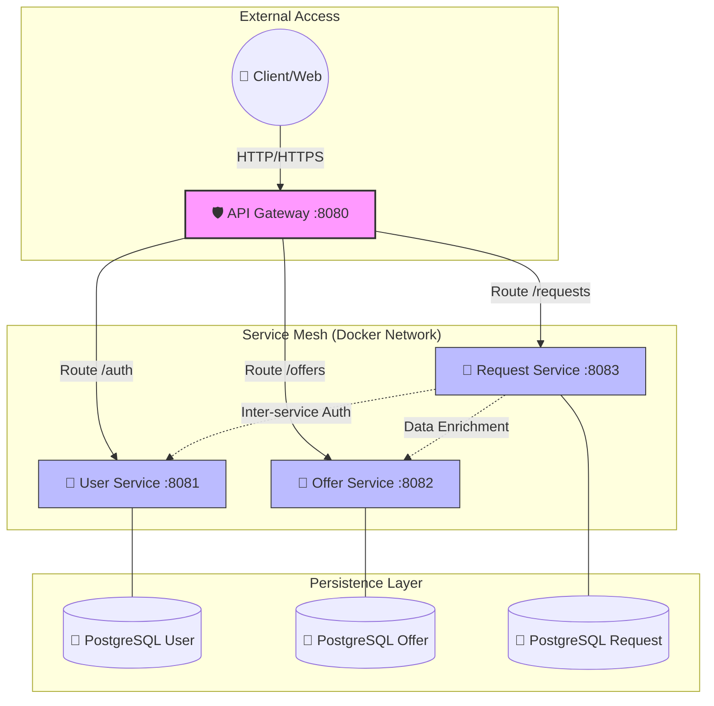

# 🌌 SkillMatch: Microservices Ecosystem

[](https://www.oracle.com/java/)
[](https://spring.io/projects/spring-boot)
[](https://www.docker.com/)
[](#-arquitetura)

> Uma infraestrutura de microsserviços de alto desempenho projetada para conectar talentos e oportunidades. O **SkillMatch** aplica os padrões de engenharia mais rigorosos utilizados por big techs para garantir escalabilidade, segurança e manutenibilidade.

---

## 🎯 Visão Geral do Projeto

O **SkillMatch** é uma plataforma distribuída que gerencia o ciclo de vida completo de ofertas de serviços e solicitações de trabalho. Projetado com foco em **Clean Architecture** e **Domain-Driven Design (DDD)**, o sistema garante que a lógica de negócio permaneça isolada de detalhes de infraestrutura.

O objetivo principal deste projeto é servir como laboratório para estudo e aplicação de conceitos modernos de desenvolvimento backend utilizando Java e Spring, focando em evolução arquitetural e qualidade de código.

### Diferenciais Técnicos:
- **Imutabilidade Nativa:** Uso intensivo de Java Records para transferência de dados.
- **Segurança Stateless:** Autenticação via JWT com validação centralizada no Gateway.
- **Database per Service:** Isolamento total de dados para evitar acoplamento.
- **Resiliência:** Implementação de Circuit Breaker e Rate Limiting para proteção do ecossistema.

---

## 🏗️ Arquitetura do Sistema

A arquitetura foi desenhada para permitir que cada serviço evolua independentemente.



---

## 🛠️ Stack Tecnológica

| Camada | Tecnologia | Motivação |
| :--- | :--- | :--- |
| **Linguagem** | Java 21 (LTS) | Virtual Threads, Records e Pattern Matching. |
| **Framework** | Spring Boot 3.2 | Ecossistema maduro para microsserviços. |
| **Segurança** | JJWT 0.12.6 | Implementação moderna de tokens JWT. |
| **Gateway** | Spring Cloud Gateway | Roteamento reativo e filtros de borda. |
| **Persistência** | Spring Data JPA / Hibernate | Abstração eficiente de dados. |
| **Bancos** | PostgreSQL 16 | Relacional robusto e extensível. |
| **Container** | Docker / Alpine Linux | Imagens leves e builds multi-stage. |

---

## 🚀 Guia de Execução Rápida

O ecossistema completo pode ser iniciado com um único comando, graças à nossa orquestração otimizada.

### Requisitos:
- Docker >= 24.x
- Docker Compose >= 2.20.x

### Passo a Passo:
1. Clone o repositório.
2. Na raiz do projeto, execute:
   ```bash
   docker-compose up --build -d
   ```
3. Acesse a documentação da API em `http://localhost:8080` (Gateway).

---

## 🛰️ API Roadmap & Endpoints

### 👤 Autenticação (User Service)
| Método | Endpoint | Descrição |
| :--- | :--- | :--- |
| `POST` | `/auth/login` | Gera Token JWT para acesso. |
| `POST` | `/auth/register` | Cria novo perfil (CLIENTE/PROFISSIONAL). |

### 💼 Ofertas (Offer Service)
| Método | Endpoint | Descrição |
| :--- | :--- | :--- |
| `GET` | `/api/offers` | Lista todas as ofertas disponíveis. |
| `POST` | `/api/offers` | Publica uma nova habilidade/oferta. |

### 📝 Solicitações (Request Service)
| Método | Endpoint | Descrição |
| :--- | :--- | :--- |
| `GET` | `/api/requests/{id}/details` | **Agregador:** Consolida dados de User e Offer. |

---

## 🛡️ Engenharia de Segurança e Resiliência

### 🔐 Segurança Stateless
O Gateway utiliza um filtro customizado que valida a assinatura dos tokens JWT. Uma vez validado, o gateway injeta informações do usuário nos headers das requisições internas, eliminando a necessidade de os microsserviços re-validarem o token contra o banco.

### 📉 Resiliência (Circuit Breaker)
Utilizamos **Resilience4j** para monitorar a saúde dos serviços. Se um serviço de destino falhar repetidamente, o Gateway "abre o circuito", protegendo o sistema de falhas em cascata e fornecendo respostas de fallback instantâneas.

---

## 🎓 Contribuição e Desenvolvimento
Este projeto foi desenvolvido como um showcase de excelência técnica. Sinta-se à vontade para explorar os pacotes, que seguem rigorosamente a **Screaming Architecture**, onde a estrutura de pastas revela a intenção do sistema, não o framework.

---
Developed with ❤️ by **lkznx7**
